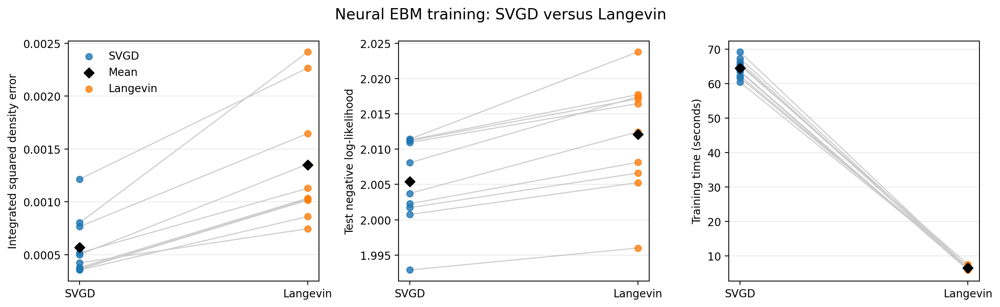

# Comparing SVGD and Langevin in a one-dimensional energy-based model

This project asks a simple question:

> What changes when the negative samples of the same neural energy-based model
> are generated with SVGD instead of Langevin dynamics?

The main experiment is deliberately one-dimensional. This makes it possible to
see the learned distribution, calculate the true answer, and check whether the
model has really learned what it should.

## What I did

I used a mixture of two Gaussian distributions as the data distribution:

```text
p(x) = 1/3 N(-2, 1) + 2/3 N(2, 1)
```

The model sees samples from this distribution and learns an energy function
`E(x)`. Low energy should correspond to likely values of `x`, and the learned
density is proportional to `exp(-E(x))`.

Training needs two kinds of samples:

- **Positive samples:** real examples drawn from the Gaussian mixture.
- **Negative samples:** particles produced by the current model.

The model lowers the energy of the positive samples and raises the energy of
the negative samples. I trained the same model twice. The only important change
between the two versions is how the negative particles move:

- **SVGD** moves all particles together. An attraction term follows the learned
  score, while a repulsion term helps the particles remain spread out.
- **Langevin dynamics** moves each particle using the learned score plus random
  Gaussian noise.

## How the comparison was kept fair

Both methods use the same:

- neural-network architecture;
- target distribution and positive batches;
- starting particle distribution;
- 10 random seeds;
- 1,000 training epochs;
- batch size of 200;
- 500 persistent negative particles;
- 20 particle-update steps per epoch;
- Adam optimizer and learning-rate schedule.

The sampler step sizes are different: `0.02` for SVGD and `0.05` for
Langevin. This is intentional. A step does not have the same numerical meaning
in the two algorithms: SVGD averages kernel interactions between particles,
whereas Langevin adds noise whose scale depends on the step size. I tried a
range of stable settings during development, selected one sensible value for
each method, and froze both values before the final ten-seed comparison. These
are empirical choices for this experiment, not universal best values.

## Main result

All 10 runs of both methods finished without numerical instability.

| Metric | SVGD | Langevin | Better result |
| --- | ---: | ---: | --- |
| Integrated squared density error | 0.000568 ± 0.000280 | 0.001349 ± 0.000582 | SVGD |
| Test negative log-likelihood | 2.0054 ± 0.0062 | 2.0121 ± 0.0081 | SVGD |
| Training time | 69.79 ± 5.31 s | 8.16 ± 0.91 s | Langevin |
| Stable runs | 10/10 | 10/10 | Tie |

Lower is better for density error, negative log-likelihood, and time. In this
experiment, SVGD produced the more accurate learned density, while Langevin
was about 8.6 times faster. This is the conclusion of this particular
controlled experiment; it is not a claim that one method is always better.



### How to read the comparison figure

Each coloured dot is one trained model. Blue represents SVGD and orange
represents Langevin. A pale line connects results obtained with the same random
seed, so each pair began under matching conditions. The black diamond shows
the average of the 10 runs.

- **Density error:** measures the area between the learned and exact density
  after squaring their difference. Zero would be a perfect match. SVGD is lower
  for every paired seed.
- **Test negative log-likelihood:** measures how well the model assigns
  probability to a separate set of target samples. Lower is better, and SVGD
  is again slightly lower.
- **Training time:** measures the complete model-training time. Langevin is
  clearly faster because it updates particles independently, while SVGD must
  calculate interactions between particles.

The second figure shows what those numerical errors look like as curves.


### How to read the curve figure

The black line is the exact answer. Blue is the average SVGD model and orange
is the average Langevin model. Each shaded band is one standard deviation
across the 10 seeds; it shows how much the trained result changed when the
random seed changed.

- **Learned density, on the left:** both methods recover the smaller mode near
  `-2` and the larger mode near `2`. The SVGD average remains closer to the
  exact curve, which agrees with its lower density error.
- **Learned energy, on the right:** low points correspond to probable regions
  and high points to unlikely regions. The energy is displayed as
  `-log p(x)`, which puts all runs on the same meaningful scale. Differences at
  the far edges look larger because the true density there is extremely small.

Together, the figures show the same trade-off from two perspectives: the
learned shape and the numerical measurements.

## How to run the final experiment

Install the dependencies from the project directory:

```bash
python -m pip install -r requirements.txt
```

Run the complete comparison:

```bash
cd experiments/1D
python compare_ebm_svgd_langevin_1d.py
```

This trains 20 models: two methods for each of the 10 seeds. On the machine
used for the project, the complete run takes roughly 20 minutes. Two figures
appear one after the other, so close the first window to see the second.

To recreate the figures from the saved results without training again:

```bash
cd experiments/1D
python compare_ebm_svgd_langevin_1d.py --plot-only
```

## Where everything is

- [`professor_submission`](professor_submission/) is the self-contained folder
  prepared for submission.
- [`experiments/1D`](experiments/1D/) contains the final experiment and the
  smaller checks used while developing it.
- [`development_tests`](development_tests/) explains which files were only
  exploratory tests.
- [`presentation`](presentation/) contains a short suggested presentation
  order.
- [`experiments/2D`](experiments/2D/) is an optional extension and is not part
  of the main conclusion.
- [`TASKS.md`](TASKS.md) records what has been completed and what remains for
  the presentation.

If someone only wants to understand or reproduce the finished work, the best
place to start is [`professor_submission/README.md`](professor_submission/README.md).

## Limits of the result

This is a small controlled study with one one-dimensional target and one neural
architecture. The exact density can be evaluated only because the example is
one-dimensional. A larger study would test more targets, model sizes, particle
counts, and computational budgets.

## Background references

- Q. Liu and D. Wang, *Stein Variational Gradient Descent: A General Purpose
  Bayesian Inference Algorithm* (2016).
- Y. Song and D. P. Kingma, *How to Train Your Energy-Based Models* (2021).
