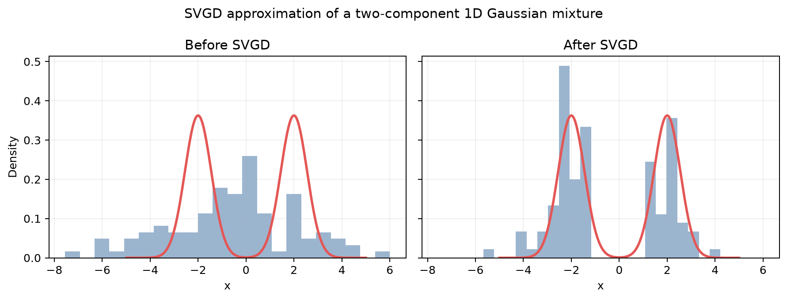

# Stein Variational Gradient Descent

Small project exploring **Stein Variational Gradient Descent (SVGD)** for
particle-based approximate Bayesian inference.

## Scope

The project considers two applications:

1. Approximating a one- or two-dimensional Gaussian mixture model.
2. Approximating the posterior distribution over the weights of a Bayesian neural
   network.

The repository currently contains a reproducible one-dimensional Gaussian mixture
example. One hundred particles are updated with SVGD to approximate an equally
weighted mixture centred at -2 and 2.



## Setup

```bash
python3 -m venv .venv
source .venv/bin/activate
python -m pip install -r requirements.txt
```

## Run the example

```bash
python experiments/svgd_gmm_1d.py
```

The script prints summary metrics and writes the resulting figure to
`experiments/results/svgd_gmm_1d.png`.

## Repository structure

- `experiments/`: implementations and generated results.
- `presentation/`: placeholder for a future Beamer presentation.
- `SOURCES.md`: primary references and documentation.
