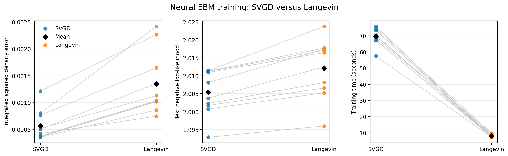
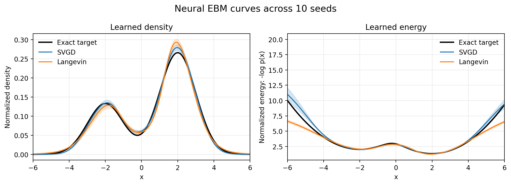

# SVGD versus Langevin for training a one-dimensional neural EBM

This is the self-contained version of my final experiment. It includes the
code, saved numerical results, and figures needed to understand and reproduce
the comparison.

## The question

An energy-based model learns a function `E(x)` that gives low energy to likely
data and high energy to unlikely data. Its probability density is proportional
to `exp(-E(x))`.

Training requires negative samples from the model. I compare two ways of
producing those samples:

- **SVGD:** particles move together using the model score and a repulsive
  interaction.
- **Langevin dynamics:** particles follow the model score and receive random
  Gaussian noise.

The question is not simply which sampler can reproduce a known distribution.
It is which sampler provides better negative particles while the neural energy
model itself is learning.

## The target distribution

The data come from this one-dimensional Gaussian mixture:

```text
p(x) = 1/3 N(-2, 1) + 2/3 N(2, 1)
```

This is the target used in the one-dimensional toy experiment of
[Liu and Wang (2016)](https://papers.neurips.cc/paper_files/paper/2016/file/b3ba8f1bee1238a2f37603d90b58898d-Paper.pdf).
It is useful here because it has two modes of unequal weight and its exact
density is known.

### Known for evaluation, unknown to the model

The neural EBM is **not trained with the exact density formula**. It sees only
positive samples drawn from the mixture. Its SVGD or Langevin negative
particles are updated with the learned model score, not with the target score.
Therefore, knowledge of the formula does not make either training method
artificially better.

I use the exact density only after training. It provides a black reference
curve and makes it possible to calculate the integrated squared density error,
the exact mean, the exact second moment, and the probability mass on each side
of zero. It acts as an answer sheet for evaluation rather than information
given to the learner.

The same EBM training procedure could be used when the real density is
unknown, but then these exact checks would be unavailable and evaluation would
need to rely on held-out samples or sample-based measures. For a controlled
course experiment, the known target gives a stronger test. Testing additional
targets would improve the generality of the conclusion; hiding the known
formula would not improve the training or make the comparison fairer.

## What was held fixed

The SVGD and Langevin runs use the same neural network, data batches, initial
particle distribution, optimizer, learning-rate schedule, and evaluation code.
For each method I used:

- 10 paired random seeds;
- 1,000 epochs;
- batches of 200 positive examples;
- 500 persistent negative particles;
- 20 sampler steps per epoch;
- Adam with an initial learning rate of `0.001`, reduced smoothly to `0.0001`.

The only algorithm-specific settings are the sampler and its step size:

- SVGD step size: `0.02`;
- Langevin step size: `0.05`.

These numbers do not need to be equal because an SVGD step and a Langevin step
have different update rules and scales. I tested several settings during
development, chose stable values that worked well for each algorithm, and then
kept them fixed for every final run. They should be understood as sensible
choices for this experiment, not as universal optima.

## What happened

All 20 training runs were numerically stable.

| Metric | SVGD, mean ± std | Langevin, mean ± std |
| --- | ---: | ---: |
| Integrated squared density error | **0.000568 ± 0.000280** | 0.001349 ± 0.000582 |
| Test negative log-likelihood | **2.0054 ± 0.0062** | 2.0121 ± 0.0081 |
| Training time | 69.79 ± 5.31 s | **8.16 ± 0.91 s** |
| Learned mean | 0.6915 ± 0.0581 | 0.6965 ± 0.0819 |
| Learned second moment | 4.7411 ± 0.0343 | 5.1374 ± 0.0253 |
| Stable runs | 10/10 | 10/10 |

For reference, the exact mean is `0.6667` and the exact second moment is
`5.0000`. Lower density error and lower test negative log-likelihood are
better.

SVGD achieved the lower density error and test negative log-likelihood in each
of the 10 paired seeds. Langevin was about 8.6 times faster. My conclusion is
therefore a trade-off: SVGD was more accurate for this experiment, while
Langevin was substantially cheaper to run.



### How to read this figure

Each coloured dot is one trained model: blue for SVGD and orange for
Langevin. A pale line connects runs with the same seed, so it shows a direct
paired comparison. The black diamond is the average over all 10 seeds.

- The **left panel** is the integrated squared density error. It measures the
  difference between the learned and exact density over the full grid. Zero
  would be perfect, so lower is better. SVGD is lower in every pair.
- The **middle panel** is the negative log-likelihood on independent test
  samples. It measures how much probability the model assigns to new target
  data. Lower is better; SVGD is slightly better here as well.
- The **right panel** is the complete training time. Lower is faster. Langevin
  is much faster because SVGD calculates interactions between particles,
  whereas Langevin updates them independently.



### How to read this figure

The black curve is the exact answer. The blue and orange curves are the
averages of the 10 SVGD and 10 Langevin models. The shaded areas show one
standard deviation across seeds, so they represent variation between training
runs rather than a new distribution.

- The **left panel** shows normalized probability density. Both methods learn
  the smaller peak near `-2` and the larger peak near `2`. SVGD follows the
  exact curve more closely on average, matching the density-error result.
- The **right panel** shows normalized energy as `-log p(x)`. Low energy means
  high probability, so its valleys correspond to the two modes. Writing the
  energy this way removes its arbitrary additive offset and makes the trained
  models directly comparable. Deviations near the edges are visually large
  because the true probability in those regions is already extremely small.

The first figure answers “how large is the difference?” and “how long does it
take?”, while the second shows where the learned distributions agree or differ
from the target.

## How to reproduce it

From this folder, install the three dependencies:

```bash
python -m pip install -r requirements.txt
```

Then run the experiment:

```bash
cd code
python compare_ebm_svgd_langevin_1d.py
```

The script trains 20 models and may take about 20 minutes, depending on the
computer. It saves the per-seed measurements and both figures in `code/results`.
The two figure windows open one after another; close the first to see the
second.

To display the saved results without retraining:

```bash
cd code
python compare_ebm_svgd_langevin_1d.py --plot-only
```

## Files in this folder

- `code/compare_ebm_svgd_langevin_1d.py` runs the final comparison and creates
  the tables and figures.
- `code/energy_model.py` defines the neural energy function and its score.
- `code/svgd_ebm_1d.py` contains the SVGD particle update.
- `code/langevin_ebm_1d.py` contains the Langevin particle update.
- `code/gmm_1d.py` defines the exact target distribution.
- `code/results/ebm_svgd_langevin_neutral_init_1d.csv` contains one row for
  every method and seed.
- `code/results/ebm_svgd_langevin_comparison_1d.png` shows accuracy and runtime.
- `code/results/ebm_svgd_langevin_curves_1d.png` shows the learned density and
  energy curves.
- The remaining short scripts and results are supporting checks for the target,
  score, and SVGD implementation.

## What this experiment does not prove

The result applies to this target, model, and computational setup. It does not
prove that SVGD is always more accurate or that Langevin is always faster. A
broader conclusion would require more distributions, dimensions, network
architectures, and hyperparameter budgets.
